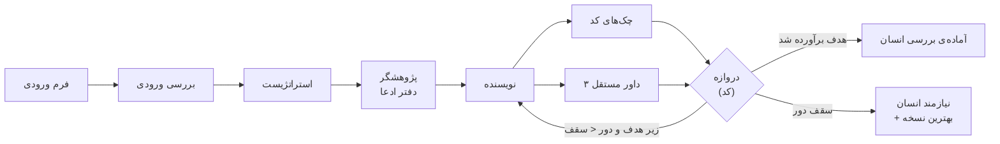

<div dir="rtl">

# استودیوی اسناد فروش

> سیستم مولتی‌ایجنت فارسی برای **نوشتن** پروپوزال، پیچ‌دک و کاتالوگ، و **سنجیدن مستقل** آن‌ها:
> نقد، اعتبارسنجی ادعا، امتیازدهی با روبریک و بازنویسی در یک Loop مستند تا رسیدن به کیفیت هدف.

**وضعیت:** فاز ۱ در حال ساخت است. وضعیت دقیق هر جزء در [`ROADMAP.md`](ROADMAP.md) است.
این README فقط چیزی را «آماده» می‌نامد که در ROADMAP تیک خورده باشد.

---

## ۱. مسئله

نوشتن سند فروش با هوش مصنوعی ساده است؛ **اعتماد به آن** سخت است. خطاهای رایج این‌هاست:

- ادعای بی‌شاهد
- جمع قیمت غلط
- تحویل‌دادنی بدون معیار پذیرش
- وعده‌ی ناممکن مثل «فروش تضمینی»

سه راهنمای این ریپو ([`guides/`](guides/)) دقیقاً همین خطاها را فهرست کرده‌اند و برای هر نوع سند یک روبریک
۱۰۰ امتیازی و فهرست «رد فوری» دارند. این سیستم آن راهنماها را به یک خط تولید اجراشدنی تبدیل می‌کند.

## ۲. چطور کار می‌کند



- **جریان کار را کد کنترل می‌کند، نه مدل.** ترتیب مراحل، دروازه‌ی قبولی و تصمیم ادامه یا توقف Loop
  با اسکریپت‌های `scripts/` گرفته می‌شود.
- **نویسنده و داور جدا هستند.** سه داور مستقل برای روبریک، ادعاها و رد فوری، به‌علاوه‌ی چک‌های قطعی کد.
- **هر نمره مدرک دارد.** داور بدون نقل‌قولی که در متن سند واقعاً پیدا شود نمی‌تواند نمره بدهد.
- **سند از طرف یک برند نوشته می‌شود.** صدا، واژه‌های ممنوع و شواهد برند از کارت برند می‌آید و ادعای برند هم
  بدون منبع «ادعای تهیه‌کننده» است، نه واقعیت تأییدشده.
- **هیچ ارسال خودکاری وجود ندارد.** بالاترین وضعیت ممکن «آماده‌ی بررسی انسان» است.

جزئیات: [`docs/۰۱-معماری.md`](docs/۰۱-معماری.md)

## ۳. ساختار ریپو

| مسیر | محتوا |
|---|---|
| [`guides/`](guides/) | سه راهنمای مرجع؛ منبع حقیقت دانش دامنه (قفل) |
| [`docs/`](docs/) | داک‌های هسته: چشم‌انداز، معماری، قرارداد ایجنت‌ها، ارزیابی، Loop، گاردریل‌ها، بازخورد، منابع |
| `schemas/` | قرارداد داده‌ی هر فایل ورودی و خروجی (JSON Schema) |
| `rubrics/` | کارت هر نوع سند: روبریک، دروازه، رد فوری، بخش‌ها و فرم ورودی |
| [`brand/`](brand/) | کارت برند (صدا، واژه‌ها، شواهد، پکیج‌ها، قواعد بصری) و منابع آن؛ پیش‌فرض: مهدیار هوش‌افزا |
| `scripts/` | اسکریپت‌های قطعی: اعتبارسنجی، چک، دروازه، Loop، رندر، بازخورد |
| `.claude/agents/` | هشت ایجنت، هرکدام با یک شغل |
| `.claude/skills/` | اسکیل‌ها: ساخت سند، ارزیابی سند، ثبت بازخورد، و [`truth`](.claude/skills/truth/SKILL.md) (حالت نقد بی‌تعارف برای داورها) |
| `evals/golden/` | گلدن‌ست برچسب‌خورده برای سنجش خود داورها |
| `runs/` | خروجی هر اجرا (محلی، جز نمونه‌ها) |

مسیرهای بدون لینک هنوز ساخته نشده‌اند؛ ترتیب ساختشان در [`ROADMAP.md`](ROADMAP.md) است.

## ۴. داک‌ها

| سؤال | سند |
|---|---|
| هدف، کاربر و مرز پروژه چیست؟ | [`docs/۰۰-چشم‌انداز.md`](docs/۰۰-چشم‌انداز.md) |
| اجزا و جریان داده چیست؟ | [`docs/۰۱-معماری.md`](docs/۰۱-معماری.md) |
| هر ایجنت چه می‌گیرد و چه می‌دهد؟ | [`docs/۰۲-قرارداد-ایجنت‌ها.md`](docs/۰۲-قرارداد-ایجنت‌ها.md) |
| نمره چطور حساب می‌شود؟ | [`docs/۰۳-سیستم-ارزیابی.md`](docs/۰۳-سیستم-ارزیابی.md) |
| Loop بازنویسی چطور کار می‌کند؟ | [`docs/۰۴-تکنیک-Loop.md`](docs/۰۴-تکنیک-Loop.md) |
| ابزارها، گاردریل‌ها و سیاست توکن | [`docs/۰۵-ابزارها-و-گاردریل‌ها.md`](docs/۰۵-ابزارها-و-گاردریل‌ها.md) |
| بازخورد انسانی و یادگیری | [`docs/۰۶-بازخورد-و-یادگیری.md`](docs/۰۶-بازخورد-و-یادگیری.md) |
| این معماری از کجا آمده؟ | [`docs/۰۷-منابع-الگو.md`](docs/۰۷-منابع-الگو.md) |
| طراحی خروجی (رنگ، فونت، اجزا) چیست؟ | [`DESIGN.md`](DESIGN.md) و [`brand/LOGO.md`](brand/LOGO.md) |
| از خطاها چه یاد گرفتیم؟ | [`docs/درس‌های-مهندسی.md`](docs/درس‌های-مهندسی.md) |

## ۵. شروع کار روی ریپو

```bash
pip install -r requirements.txt
git config core.hooksPath .githooks     # handoff.md پیش از هر کامیت و پوش چک می‌شود
python3 -m unittest discover -s tests
```

وضعیت لحظه‌ای کار و قدم بعد: [`handoff.md`](handoff.md).

## ۶. دامنه

- **فاز ۱ (همین ریپو):** نویسنده و ارزیاب پروپوزال، پیچ‌دک و کاتالوگ.
- **فاز ۲ (بعداً):** موشن گرافیک. در این ریپو هنوز هیچ کاری برایش انجام نشده است.

</div>
