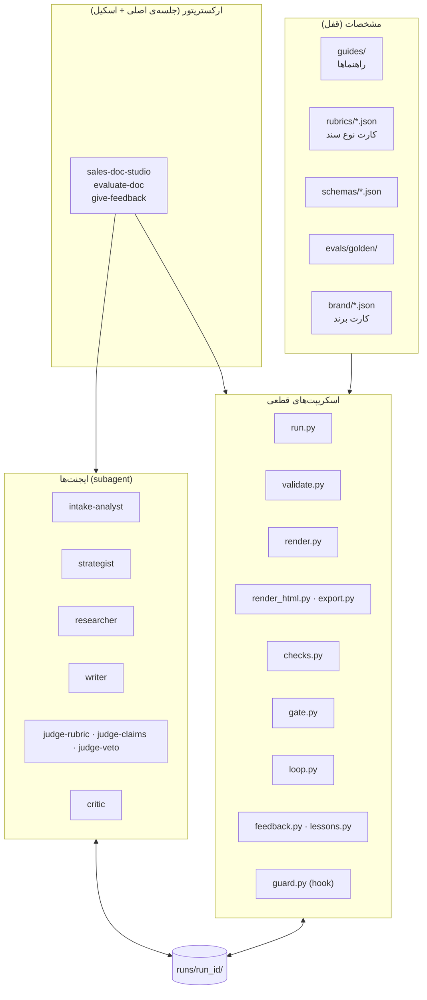
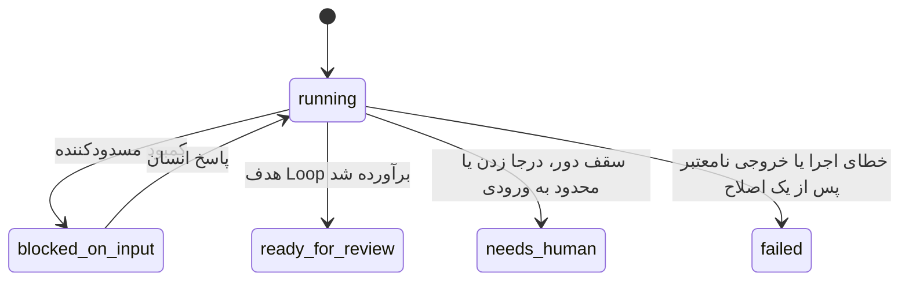
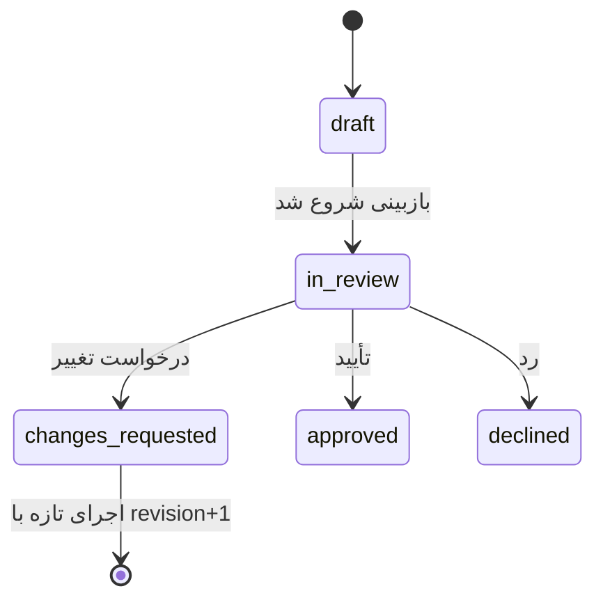

<div dir="rtl">

# ۰۱ — معماری

## ۱. نوع سیستم: workflow، نه agent آزاد

طبق تفکیک Anthropic ([`۰۷-منابع-الگو`](۰۷-منابع-الگو.md) بخش ۵)، این سیستم **workflow** است: مسیر از پیش در
کد و اسکیل تعیین شده و مدل‌ها فقط کارهای قضاوتی را انجام می‌دهند. الگوی اصلی آن **evaluator-optimizer** است:
یک نویسنده تولید می‌کند و ارزیاب‌های مستقل نقد می‌کنند، در یک حلقه با سقف.

سه قاعده که همه‌جا تکرار می‌شوند (منبع: arkan، سطح الف):

1. **ترتیب مراحل، دروازه و تصمیم Loop با کد است.**
2. **هر کار قطعی با کد است:** شمارش، جمع، تطبیق شناسه، عبارت ممنوع، اعتبارسنجی.
3. **مدل فقط برای قضاوت است** و هر قضاوت مدرک دارد: نقل‌قولی که کد در متن پیدا کند.

## ۲. اجزا



| لایه | مالک تصمیم | چه چیزی را نمی‌تواند |
|---|---|---|
| مشخصات | انسان (با PR) | در طول اجرا تغییر کند |
| ارکستریتور | اسکیل، با مراحل ثابت | مرحله‌ای را جا بیندازد یا آستانه‌ای را عوض کند |
| اسکریپت‌ها | کد قطعی | قضاوت کیفی کند |
| ایجنت‌ها | مدل، داخل قرارداد خروجی | بیرون از فایل‌های مجاز خودش بنویسد یا ایجنت دیگری بسازد |

## ۳. پوشه‌ی یک اجرا

```
runs/<run_id>/                     run_id = YYYYMMDD-HHMMSS-<doc_type>
├── run.json                       وضعیت اجرا                       ← run.py
├── input.json                     فرم ورودی                         ← کاربر، از راه run.py
├── context/                       برش‌های راهنما، brand.md و درس‌ها (فقط‌خواندنی) ← run.py، lessons.py
├── gaps.json · questions.json     کمبودها و سؤال‌ها                  ← intake-analyst
├── brief.json                     بریف                              ← strategist
├── claims.json                    دفتر ادعا                          ← researcher
├── document.v<n>.json             سند دور n (منبع حقیقت)             ← writer
├── revision.v<n>.json             تغییرات دور n                      ← writer
├── document.v<n>.md               رندر                              ← render.py
├── checks.v<n>.json               چک‌های قطعی                        ← checks.py
├── judges/v<n>/{rubric,claims,veto}.json   گزارش داورها              ← سه داور
├── gate.v<n>.json                 نمره و تصمیم قبولی                  ← gate.py
├── issues.v<n>.json               ایرادهای قابل‌اجرا برای دور n+1     ← loop.py
├── loop.json · loop-log.md        قرارداد و تاریخچه‌ی Loop            ← loop.py
├── lessons.proposed.json          درس‌های پیشنهادی                    ← critic
└── final/                         بهترین نسخه + گزارش نهایی           ← loop.py
```

هر فایل JSON یک schema در `schemas/` دارد ([`۰۲-قرارداد-ایجنت‌ها`](۰۲-قرارداد-ایجنت‌ها.md)).

## ۴. خط تولید: ورودی و خروجی هر مرحله

هر مرحله **فقط** ستون «ورودی» خودش را می‌خواند و **فقط** ستون «خروجی» را می‌نویسد. hook نوشتن بیرون از خروجی
مجاز را رد می‌کند ([`۰۵-ابزارها-و-گاردریل‌ها`](۰۵-ابزارها-و-گاردریل‌ها.md)).

| # | مرحله | اجراکننده | ورودی | خروجی | کنترل کد بعد از مرحله |
|---|---|---|---|---|---|
| 0 | آغاز | `run.py new` | فایل فرم | `run.json`، `input.json`، `context/*` | فرم با `intake.schema` معتبر باشد |
| 1 | بررسی ورودی | intake-analyst | `input.json`، `context/intake_form.md` | `gaps.json`، `questions.json` | هر فیلد الزامیِ خالی در `gaps.json` باشد؛ حداکثر ۵ سؤال؛ کمبود مسدودکننده ← `blocked_on_input` |
| 2 | بریف | strategist | `input.json`، `gaps.json`، `context/doc_types.md`، `context/architecture.md`، `context/brand.md` | `brief.json` | همه‌ی بخش‌های الزامی کارت نوع سند در بریف باشند |
| 3 | دفتر ادعا | researcher | `input.json`، `brief.json`، `context/evidence_rules.md`، `context/brand.md` | `claims.json` | ادعای «واقعی» بدون منبع نباشد؛ منبع «ورودی» به فیلد غیرخالی، منبع «برند» به شاهد موجود کارت برند، و URL به فهرست جست‌وجوها اشاره کند |
| 4 | نگارش | writer | `brief.json`، `claims.json`، `gaps.json`، `context/{architecture,operations,writing_rules,brand}.md`، درس‌ها؛ از دور ۲: نسخه‌ی پایه + `issues.v<n-1>.json`؛ در اجرای «درخواست تغییر»، از دور ۱: `issues.v0.json` با ایرادهای انسان | `document.v<n>.json`، `revision.v<n>.json` | schema سند؛ یکتایی شناسه‌ها؛ ارجاع‌های `cost_benefit` |
| 5 | رندر | `render.py` | `document.v<n>.json` | `document.v<n>.md` | — (قطعی) |
| 6الف | چک‌ها | `checks.py` | `document.v<n>.json`، `.md`، `claims.json`، کارت نوع سند | `checks.v<n>.json` | — (قطعی) |
| 6ب | داوری (موازی) | سه داور | `document.v<n>.md` + ورودی‌های هر داور (بخش ۲ سند قرارداد) | `judges/v<n>/*.json` | schema؛ **هر نقل‌قول باید در متن سند پیدا شود** |
| 7 | دروازه | `gate.py` | `checks.v<n>.json`، `judges/v<n>/*`، کارت نوع سند | `gate.v<n>.json` | — (قطعی) |
| 8 | Loop | `loop.py record` | `gate.v*.json`، `loop.json` | `loop.json`، `loop-log.md`، `issues.v<n>.json` | تصمیم: ادامه، توقف یا برگشت به بهترین نسخه |
| 9 | پایان | `loop.py finalize` | بهترین نسخه | `final/*`، وضعیت نهایی در `run.json` | — |
| 9ب | تحویل | `export.py` (با `render_html.py`) | بهترین `document.v<n>.json`، `input.output_formats`، کارت برند، `DESIGN.md`، لوگو | `final/<نام>.{md,html,pdf}` به‌اندازه‌ی فرمت‌های خواسته‌شده | — (قطعی؛ PDF از Chromium با متن قابل‌انتخاب؛ docx و pptx بعد از H2 و تا آن وقت خطای صریح) |
| 10 | درس | critic ← `lessons.py add` | `loop.json`، آخرین `gate`، بازخوردها | `lessons.proposed.json` ← `lessons/lessons.json` | حداکثر ۳ درس، سقف ۸ درس فعال برای هر ایجنت |

مراحل ۴ تا ۸ همان Loop اصلی‌اند ([`۰۴-تکنیک-Loop`](۰۴-تکنیک-Loop.md)).

## ۵. وضعیت‌ها: دو محور جدا

دو پرسش متفاوت، دو فیلد متفاوت در `run.json`، بدون هم‌پوشانی:

**الف) `status`: ماشین به کجا رسید؟** (فقط کد تعیین می‌کند)



**ب) `lifecycle`: انسان با سند چه کرد؟** (فقط انسان، از راه `give-feedback`؛ الگوی arkan-crm)



- تأیید سندی که `status` آن `ready_for_review` نیست فقط با دلیل صریح انسان ثبت می‌شود (`--override`).
- `approved` یعنی «انسان پذیرفت»، نه «ارسال شد». سیستم هیچ ارسالی ندارد.

## ۶. مسیر ارزیابی تنها (`evaluate-doc`)

برای سندی که بیرون از این سیستم نوشته شده (JSON یا Markdown):

`run.py new-eval` ← (`render.py` اگر JSON است) ← `checks.py` ← سه داور ← `gate.py` ← گزارش

- بدون Loop و بدون نویسنده.
- برای ورودی Markdown چک‌های ساختاری (جمع قیمت، شناسه‌ی تحویل و پذیرش) اجرا نمی‌شوند و در گزارش با وضعیت
  `skip` و دلیل «سند ساخت‌یافته نیست» می‌آیند. نمره‌ی چنین سندی محدودتر است و گزارش این را صریح می‌گوید.

## ۷. مسیر خطا

| خطا | رفتار |
|---|---|
| خروجی ایجنت با schema نمی‌خواند یا نقل‌قولش در متن نیست | hook توقف ایجنت یک بار آن را با فهرست خطا برمی‌گرداند؛ بار دوم اجرا `failed` می‌شود و خطا در `run.json` ثبت می‌شود |
| اسکریپت خطا می‌دهد | `failed` با نام مرحله و پیام خطا |
| کمبود مسدودکننده در ورودی | `blocked_on_input`؛ سؤال‌ها به کاربر نشان داده می‌شود؛ حداکثر ۲ دور بررسی ورودی |
| همه‌ی ردیف‌های زیر هدف «محدود به ورودی» هستند | Loop زودتر متوقف می‌شود: `needs_human` با فهرست ورودی‌های لازم (بازنویسی کمکی نمی‌کند) |

## ۸. منبع حقیقت هر قاعده

| قاعده | فقط اینجا تعریف می‌شود |
|---|---|
| وزن‌ها، آستانه‌ها، ردیف‌های حیاتی، رد فوری، بخش‌ها، فیلدهای فرم، نام برش‌ها | `rubrics/<type>.json` |
| صدا، واژه‌های ممنوع برند، شواهد برند و وضعیت اعتبارشان، پکیج‌ها، قواعد بصری | `brand/<id>.json` |
| عبارت‌های ممنوع | `rubrics/banned.json` |
| شکل هر فایل | `schemas/*.schema.json` |
| ترتیب مراحل | `.claude/skills/sales-doc-studio/SKILL.md` |
| رفتار هر ایجنت | `.claude/agents/<name>.md` |
| سقف دور و تصمیم Loop | `loop.py` + `loop_target` در کارت نوع سند |

داک‌ها این قواعد را **توضیح** می‌دهند، اما عدد مرجع همیشه در فایل‌های بالاست. اگر داک و فایل اختلاف داشتند،
فایل درست است و داک باید اصلاح شود.

</div>
